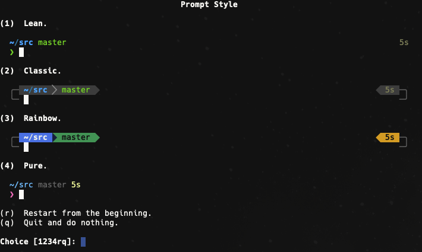

# Onyx-Environments

## CLI Configuration (General)

### Final Look

### Download & Install Font
https://eng.m.fontke.com/font/24637081/

### Install OhMyZSH
sh -c "$(curl -fsSL https://raw.githubusercontent.com/ohmyzsh/ohmyzsh/master/tools/install.sh)"

### Install Warp
brew install warp

### Install Powerlevel10k Theme
git clone --depth=1 https://github.com/romkatv/powerlevel10k.git ~/powerlevel10k
echo 'source ~/powerlevel10k/powerlevel10k.zsh-theme' >>~/.zshrc

### Configure Powerlevel10k Theme
p10k configure

### Configure Warp
Settings > Appearance > Click 'Prompt' configuration box > Select 'Shell prompt' (PS1)
** This will configure Warp to use our PS1-applied theme & not Warp's own "injected" theme

### Sources
https://www.youtube.com/watch?v=WXiNkZVmkD4&ab_channel=Warp

### Additional Themeing Sources
https://starship.rs/presets/

## CLI Configuration (MacOS)

### Install Brew
/bin/bash -c "$(curl -fsSL https://raw.githubusercontent.com/Homebrew/install/HEAD/install.sh)"
** RUN suggested Path commands after
